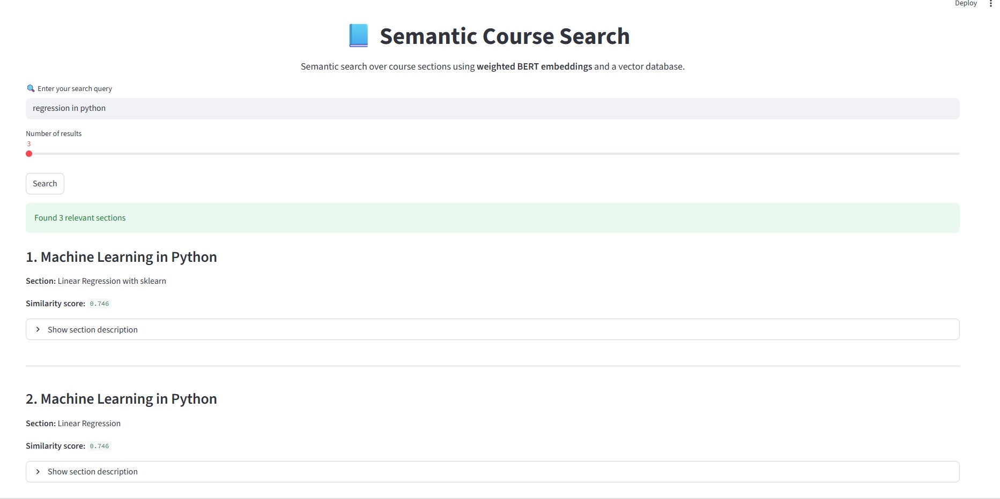

# 📘 Semantic Course Search with Vector Databases

This project designs, evaluates, and deploys a **semantic search system for online course content** using modern sentence embeddings and a vector database.  
The goal is to compare multiple semantic search strategies and deploy the **best-performing approach** as an interactive web application.

---

## 🚀 Project Motivation

Traditional keyword-based search systems often fail to capture the **semantic intent** behind user queries, especially in educational content where meaning and context matter more than exact word matches.

This project addresses that limitation by leveraging **vector-based semantic search**, enabling retrieval of course content based on **conceptual similarity rather than keywords**.

Multiple embedding models and data granularities are evaluated to identify the most accurate and context-aware solution.

---

## 📊 Datasets

Two datasets are used to explore different levels of semantic granularity:

### 🔹 Course-level descriptions
- **File:** `course_descriptions.csv`
- High-level summaries describing the overall content of each course.

### 🔹 Section-level descriptions
- **File:** `course_section_descriptions.csv`
- Fine-grained descriptions of individual sections within each course, enabling more precise retrieval.

---

## 🧠 Evaluated Semantic Search Approaches

Four semantic search strategies were implemented and compared.

---

### 1️⃣ Course-level Search (Baseline)
- **Data:** Course descriptions  
- **Model:** `all-MiniLM-L6-v2`  
- **Granularity:** Course level  

A fast and lightweight baseline providing coarse-grained semantic matching.

📌 *Strength:* Fast  
📌 *Limitation:* Low precision

---

### 2️⃣ Section-level Search (MiniLM)
- **Data:** Course section descriptions  
- **Model:** `all-MiniLM-L6-v2`  
- **Granularity:** Section level  

Improves retrieval precision by operating at section granularity while maintaining low computational cost.

📌 *Strength:* Efficient and more precise  
📌 *Limitation:* Limited semantic depth

---

### 3️⃣ Section-level Search (BERT – Unweighted)
- **Data:** Course section descriptions  
- **Model:** `multi-qa-distilbert-cos-v1`  

Leverages a stronger transformer-based embedding model for improved semantic understanding, without applying explicit weighting across text components.

📌 *Strength:* Strong semantic understanding  
📌 *Limitation:* Context not explicitly reinforced

---

### 4️⃣ Section-level Search (BERT – Weighted) ✅ **Final Model**
- **Data:** Course section descriptions  
- **Model:** `multi-qa-distilbert-cos-v1`  
- **Technique:** Weighted semantic embeddings  

Introduces **weighted semantic representations** to emphasize the core semantic intent of user queries while reinforcing contextual relevance.

📌 *Strength:* Best balance of precision, relevance, and interpretability  
📌 *Selected for deployment*

---

## 🖥️ Deployed Application

The final model is deployed as an interactive **Streamlit application**, allowing users to:

- Enter natural language queries
- Retrieve the most semantically relevant course sections
- Inspect similarity scores
- Explore section-level descriptions

### 🔍 Application Demo


---

### 📈 Example Search Results

The system retrieves highly relevant course sections based on semantic similarity rather than keyword overlap.



---

## 🧪 Weighted Semantic Querying (Key Idea)

Instead of encoding user queries once, the final approach **reinforces semantic intent** by combining multiple embeddings:

- Primary query embedding
- Contextualized query embedding

These embeddings are combined using weighted averaging before querying the vector database.

This technique improves retrieval quality for ambiguous or short user queries.

---

## 🏗️ Project Structure

```text
semantic-course-search/
│
├── data/
│   ├── course_descriptions.csv
│   └── course_section_descriptions.csv
│
├── notebooks/
│   ├── 01_course_level_minilm.ipynb
│   ├── 02_section_level_minilm.ipynb
│   ├── 03_section_level_bert.ipynb
│   └── 04_section_level_bert_weighted.ipynb
│
├── assets/
│   ├── app_ui.png
│   └── search_results.png
│
├── result/
│   └── qualitative_examples.md
│
├── app.py
├── requirements.txt
└── README.md
